Git & Git hub
=======================

## github의 시작

1. 계정을 생성해준다

2. 계정을 생성후 repository를 생성해주면 code부분에 setup을 하는 방법이 나와있다

<hr/>
## Git의 Gitbuh 자동 로그인 

1. 이중 ssh를 이용하여 매번 git push를 할때 아이디 비밀번호를 입력할 필요 없게 설정을 해준다

2. ssh-keygen -t rsa -C "cfd0318@gmail.com" 를 입력해주면 rsa key를 얻을수 있다.

3. 
```
   $ ssh-keygen -t rsa -C "cfd0318@gmail.com"
   Generating public/private rsa key pair.
   Enter file in which to save the key (/c/Users/mobigen/.ssh/id_rsa):
   Enter passphrase (empty for no passphrase):
   Enter same passphrase again:
   Your identification has been saved in /c/Users/mobigen/.ssh/id_rsa
   Your public key has been saved in /c/Users/mobigen/.ssh/id_rsa.pub
   The key fingerprint is:
   SHA256:Awi8VosyvulVk602I7pStXg4fS86jJnb6BtJSLdmBSs cfd0318@gmail.com
   The key's randomart image is:
   +---[RSA 3072]----+
```
4. /c/Users/mobigen/.ssh/id_rsa에 id_rsa가 생성되었다.

5. 이 파일의 긴 문자열을 github의 올리려고 햇던 저장소의 setting메뉴 Deploy keys에 추가로 등록을 해준다

6. 이후에 add, commit, push를 통해 github에 파일을 저장할수 있다.

<hr/>

## Git에서 자주 쓰이는 용어의 개념 및 사용법

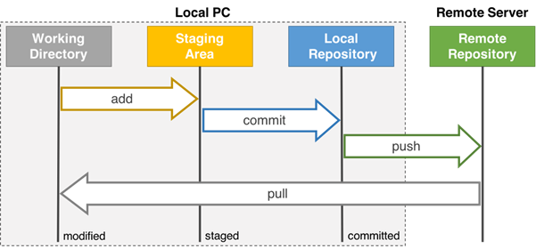

###### _Remote Repository에는 README.md 파일만 있다고 가정_

+ **init**
  + 깃 저장소를 초기화한다. 저장소나 디렉토리 안에서 이 명령을 실행하기 전까지는 그냥 일반 폴더이다.

```
  git init
```

+ **status**

  + 저장소의상태를 체크하며 어떤 파일이 저장소에 있고 커밋이 필요한 변경사항이 있는지, 현재 저장소의 어떤 브랜치에서 작업하고 있는지 등을 확인 할수 있다.

```
  git status
```

+ **add**

  - add명령어로 repository에 새 파일들을 추가 하지는 않는다.
  - 대신 깃이 새파일들을 주시하게 해준다.
  - Working Directory에 있는 README.md를 Staging Area에 보내준다.
```
  git add README.md
```

+ **commit**

  + 어떤 변경사항이 생겼다면 repository의 스냅샷을 찍기 위해 입력을 해준다.
  
  + Staging Area에 있는 README.md를 Local Reository에 보내준다.
```
  git commit -m "first commit"
```
- 이때까지 하나의 commit이 버전의 구분점이 되며 이전 버전에서 해당 버전으로의 변경내역이 local 저장소에 담겨 있다. 이는 모두 local에서 작동한다.


+ **push**

  + Local Repository에 있는 README.md를 Remote Repository로 올려준다.
  + git push를 통해 remote 저장소에 commit을 올려준다.
```
  git push 
```

+ **pull**

  + Remote Repository에 있는 README.md를 Remote Repository로 올려준다.
  + origin repository에서 변경 사항을 가져와 현재 branch에 합친다.

```
  git pull
```

+ **branch**

  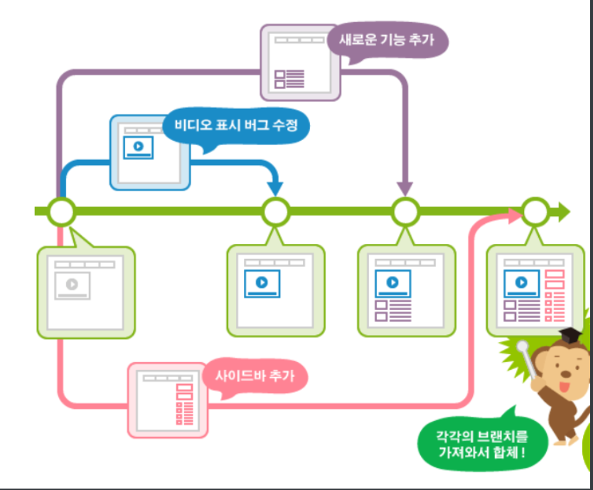
  
  + 여러 사람과 작업하고 자신만의 작업을 원할때 즉, 독립적 작업을  할 때 사용한다.
  
  + 새로운 브랜치를 만들고 자신만의 변경사항등의 커밋 타임라인을 만든다.
  
  + 동시에 여러 작업을 진행할 수 있다.
  
  + 이렇게 동시에 작업한 branch들을 나중에 merge할 수 있다.
  
  + newbranch라는 새로운 branch를 생성한다.
  
```
    git branch newbranch
```

  + **branch 참고사항**
      + branch의 종류는 5가지가 존재한다
      + master : 제품으로 출시될 수 있는 브랜치
      + develop : 다음 출시 버전을 개발하는 브랜치
      + feature : 기능을 개발하는 브랜치
      + release : 이번 출시 버전을 준비하는 브랜치
      + hotfix : 출시 버전에서 발생한 버그를 수저하는 브랜치


+ **Master branch**
  + Master branch란 처음 저장소를 만들 때 생성되는 branch
  + 새로운 파일을 추가하거나 변경 시 그 내용을 저장하는 곳은 모두 master branch를 통해 merger한다.

+ **merge**

  + 브랜치에서 작업을 끝내고, 모든 협업자가 볼수 있는 master 브랜치로 병합한다.

```
  git merge
```

+ **clone**

  + remote repository를 local repository로 복제할때 사용한다

```
    git clone https://github.com/jheok318/git_test
```

+ **log**

  + 현재 git에서 일어난 모든 이력을 확인 한다.

```
  git log
```

+ **fork**

  + Fork를 통해 다른 사람의 repository를 가져와 내 repository를 만든다.
  + 이후 git clone으로 내 repository에 있는 파일들을 Working  Directory로 가져온다.
  + 이 clone으로 가져온 파일에서 add, commit을 하여도 원본 저장소에는 영향이 없다.

+ **Pull Request**

  + 내 저장소에서 add, commit, push를 한 후에 원본 저장소에 이 작업을 반영해달라고 요청하는 것이 Pull Request이다.

<hr/>

## Git commit  message의 규칙 및 사용시 도움이 될만한 것들

1. **제목과 본문을 빈행으로 분리한다.**
   + 필수 사항은 아니다.
   + 한줄만 작성해도 괜찮은 경우들이 존재한다.
   + 제목과 본문 사이에 공백을 넣으면 로그를 확인 할때 어떤 경우라도 제목과 본문을 출력해준다.

```
$ git log --oneline
59e2bf2 (HEAD -> master, origin/master) README.md or imgfile
05eab6e README.md
37866b9 README.md

$ git shortlog
jun_heok (3):
      README.md
      README.md
      README.md or imgfile
```


2. **제목 행을 50자로 제한한다.**
   + 제목 행을 50자로 작성하는 것은 강제로 제한 하는것은 아니다.
   + GitHub UI는 50자 이상을 입력하려고 하면 경고 표시가 나타난다.
   + 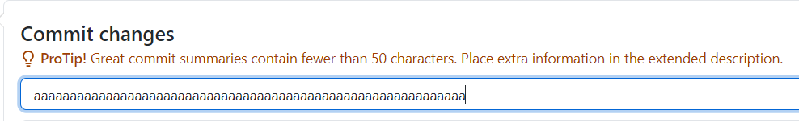
3. **제목 행 첫 글자는 대문자로 쓴다**
   + 제목 행에서의 모든 단어는 대문자로 시작함을 생각하자
   + readme.md file change.  =>  Readme.md file change.
4. **제목 행에 명령문을 사용한다.**
   + 명령이나 설명하듯 제목 행을 작성해준다.
   + Git 자체는 우리 대신 자동으로 커밋을 생성하는 경우, 명령조로 사용을 한다.
   + 이는 제목 행에서만 생각을 하며 본문을 쓸때는 생각할 필요 없다.
   + Readme.md file change. => Change readme.md file.
5. **제목 행 끝에 마침표를 넣지 않는다.**
   + 제목 행 끝에는 마침표가 필요없다. 50자 미만의 규칙을 따르면 한 공간도 필요로 하다.
   + Change readme.md file. => Change readme.md file
6. **본문은 72자 기준으로 개행한다.**
   + Git은 본문을 자동으로 개행하지 않는다.
   + 커밋 메세지 본문을 적을 땐 본문 우측 여백을 신경쓰며 작성해야 하고, 본문을 정해진 대로손수 개행 해야 한다
   + 72자 기준으로 개행을 하면 전체 80자 공간중 Git이 들여쓰기 문자를 위해 여유 문자를 가질 수 있다.
7. **어떻게 보다 무엇과 왜를 쓴다.**
   + 대부분은 어떻게 바뀌었는지를 남긴다.
   + 하지만 왜 바꾸었는지에 주목을 해보면 바꾸기전에 무엇을 했는지(무엇이 잘못 동작 했는지)
   + 지금은 어떻게 동작하는지 그리고 왜 그렇게 바꾸기로 했는지를 중점적으로 적어주는 것이 좋다.

<hr/>

## Git hub(remote repasitory)에서 branch관리

1. **branch생성**
   
   + git hub에서 master라고 적혀 있는 부분을 클릭한다.
   + 이후 branch를 선택하거나 원하는 브랜치를 생성해준다.
+ 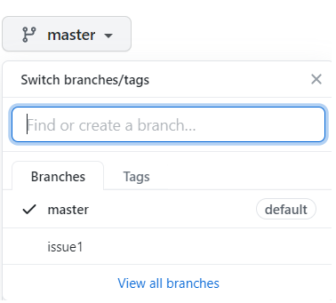
   
+ issue2를 생성해보자
   + issue2가 생성 됨을 확인할수 있다.
   + 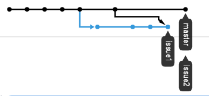

2. **수정후 commit 하기**  

   - Readme.md 파일을 수정해보고 커밋을 해주면 이 파일은 master와 다른 파일을 가지고 있다.
   - squash merge를 사용해 보기 위해 issue2를 한번더 수정하고 커밋 해주었다.
   - 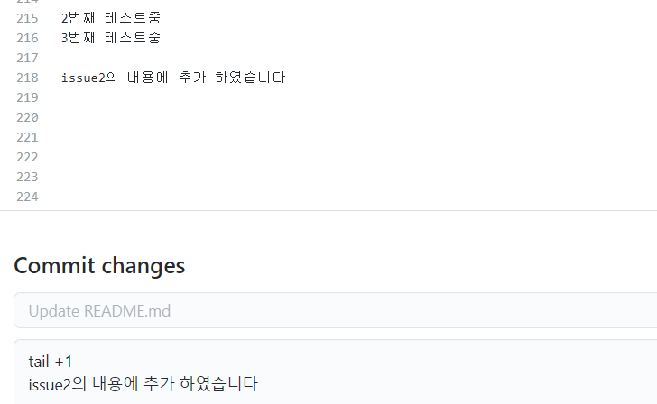

3. **Pull Request 열기**
   - issue2 branch 에서 수정한 Readme.md 파일을 master branch에 branch를 합치기 위해 PR을 이용한다.
   - 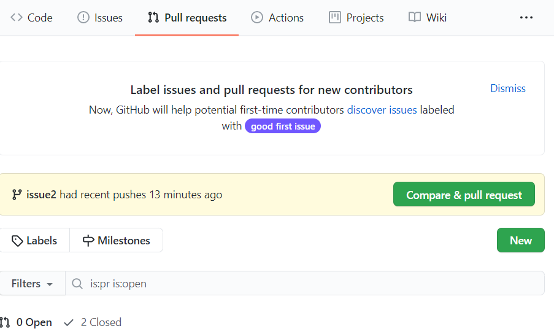

   - Pull request를 선택후 New를 선택해 준다
   - 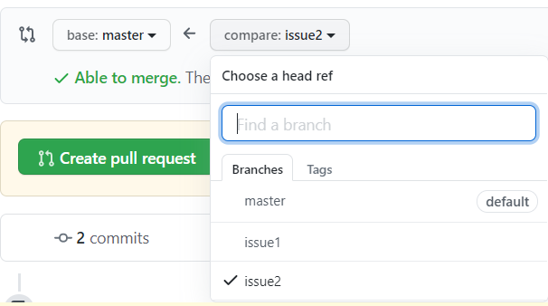

   - compare에 issue2를 선택하고 base를 master로 선택해준다
   - 이후 스크롤을 내려보면 아래 수정된 내용들이 나오게 된다 이상이 없다면 create pull request를 눌러준다
   - PR의 제목과 수정사항에 대한 설명 혹은 변경사항등을 작성한후 create해준다
   - 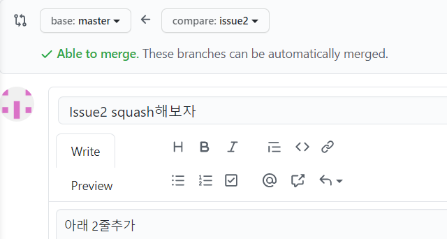

4. Merge Pull Request

   - 원하는 Merge 방식을 선택해주면 merge가 완료 된다.
-  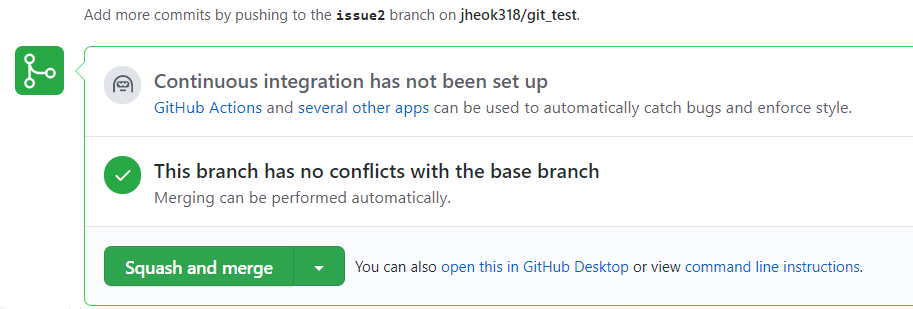
   
   - sqush - merge방식을 사용 하였는데 이가 잘되었는지 확인해보자
   - 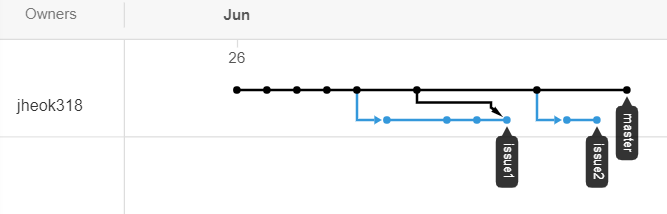


<hr/>

## git remote branch가져오기

1. 원격의 branch에 접근하기 위해 git remote를 갱신해준다

   ```
   git remote update
   ```

2.  원격 저장소 branch 확인법

   ```
   git branch -r or git branch -a
   ```

3.  원격 저장소의 branch 가져오기

   - origin/issue2 branch를 가져오고 싶을때 사용법

   ```
   git checkout -t origin/issue2
   ```

   - -t 옵션과 원격 저장소의 branch이름을 입력하면 로컬의 동일한 이름의 branch를 생성하면서 해당 branch로 checkout을 한다.
   - 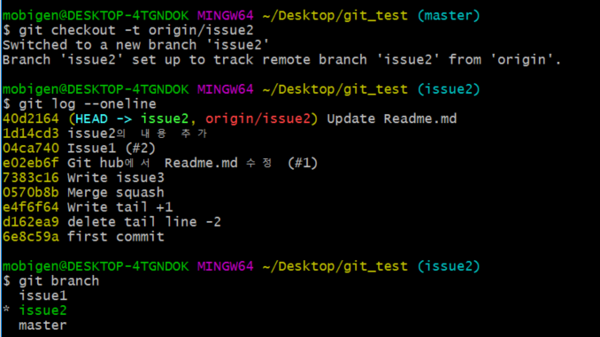

_issue2 branch를 저장소에서 가져오고 현재 issue2의 branch상태를 확인해 보았고 issue2의 branch가  local branch에 추가 됨을 확인할수 있다._

<hr/>

## 종합

1. local에서 git을 통해 github와 연동을 한다.
2. github에서 fork를 통해 원하는 다른 사람의 repository를 내 repository로 가져온다.
3. github의 insight => network를 통해 현재 branch 상태를 확인한 후 원하는 remote branch를 내 local repository로 가져온다. 
4. 내 local에서 작업후 push를 통해 해당 branch를 업데이트 시켜준다. 
5. PR을 통해 수정된 branch를 squash merge를 이용하여 업데이트 시켜준다.
6. 2~5을 반복하면서 사용해준다.